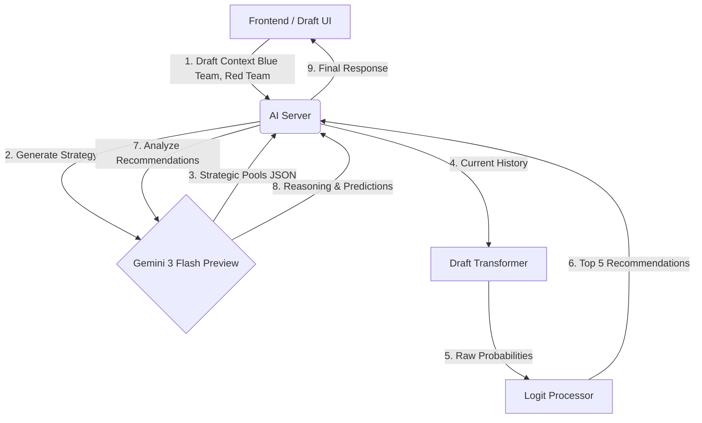

# AI Draft Architecture

This document describes the Hybrid AI architecture used in the DraftPredictor.

## 1. Overview
The system uses a **Two-Layer Approach** to generate draft recommendations:
1.  **Strategic Layer (LLM / Gemini)**: Analyzes the high-level matchup (Team vs Team, Player Pools) to generate a "Game Plan" or "Pool" of champions for each phase of the draft.
2.  **Tactical Layer (Transformer)**: Predicts the immediate next best move based on the specific sequence of picks and bans that have occurred so far, conditioned/guided by the Strategic Layer.

## 2. Data Flow



## 3. Components

### A. The Strategic Layer (Gemini)
**Trigger**: At the start of the draft (or first prediction request).
**Input**: 
- Blue Team Roster (Player Names, Roles)
- Red Team Roster
**Output (JSON)**:
Values are lists of recommended champions for specific phases.
```json
{
  "blue_ban_phase_1": ["ChampA", "ChampB", ...],
  "red_ban_phase_1": [...],
  "blue_pick_phase_1": [...],
  "red_pick_phase_1": [...],
  "blue_ban_phase_2": [...],
  ...
}
```
**Role**: Sets the "Meta" for the match. It ensures the model doesn't suggest nonsensical champions just because they are statistically probable in a vacuum, but rather champions that fit the specific players and team identities.

### B. The Tactical Layer (Transformer)
**Trigger**: Every step of the draft.
**Input**: Sequence of picks and bans so far.
**Role**: Handles the "Micro" logic of the draft (e.g., "They picked X, we must counter with Y"). It has learned the statistical patterns of draft orders and counters.

### C. The Integration (Logit Processing)
The "Right List at the Right Time" logic:
1.  Server determines current **Phase** (e.g., Phase 1 Pick).
2.  Server determines **Acting Team** (e.g., Blue).
3.  Server retrieves the corresponding list from the Gemini Strategy (e.g., `blue_pick_phase_1`).
4.  **Boosting/Filtering**:
    - The Transformer's logits for champions in the Gemini list are **boosted** (e.g., +2.0 logit bias).
    - Alternatively, we can use a "Mask" to only allow champions from the Gemini pool (Strict Mode), or just combine probabilities (Soft Mode).
    - *Initial Implementation*: **Soft Boost**. High-confidence Transformer predictions can still override Gemini if necessary, but Gemini candidates are heavily preferred.

## 4. Phase Definitions
- **Phase 1 Bans**: Steps 1-6
- **Phase 1 Picks**: Steps 7-12
- **Phase 2 Bans**: Steps 13-16
- **Phase 2 Picks**: Steps 17-20
